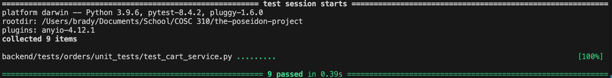

Cart Service testing

This test file verifies the logic for managing shopping carts embedded within the `User` model.

It uses `unittest.mock` to simulate the `UserRepository`, allowing for fast, isolated testing without modifying users.json. The suite applies Equivalence Partitioning to validate core features like `add_item`, `remove_item`, and `clear_cart`. It also uses Boundary Value Analysis to ensure that `update_item_quantity` correctly removes an item if the quantity is set to zero. Finally, Fault Injection is used to confirm that `get_cart` and `_save_cart_to_user` properly raise a 404 `HTTPException` if a user is not found.